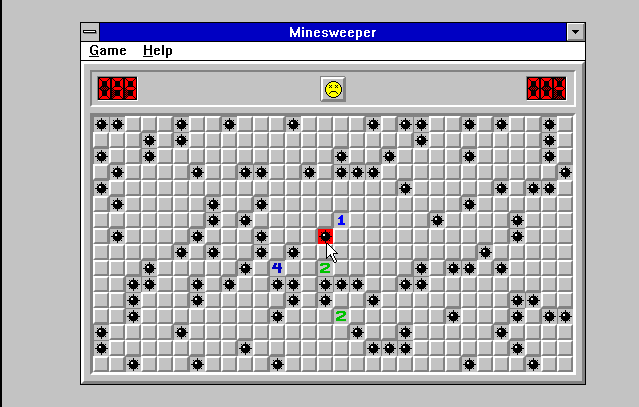
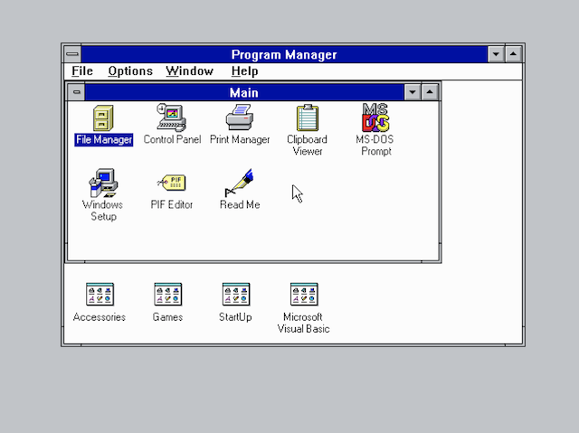
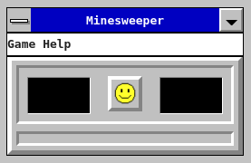
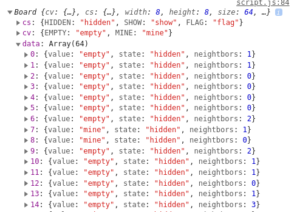
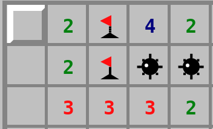
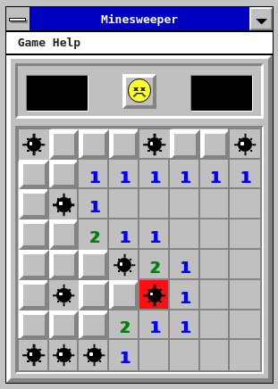
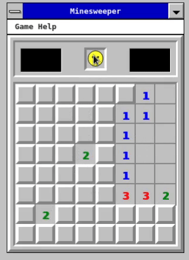
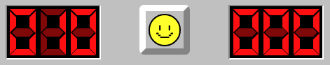
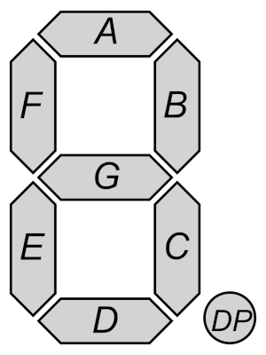

# MINESWEEPER ALMOST FROM SCRATCH

This is an attempt of making the game [Minesweeper](https://en.wikipedia.org/wiki/Minesweeper)
using modern programming languages. The idea is to time the development and track the progress of each stage in this document. If possible I want to finish this project in under 24 h.

Minesweeper is a classic for Windows machines and is still rolling.

For previous projects, I worked a lot with [Canvas](https://developer.mozilla.org/en-US/docs/Web/API/Canvas_API), this time I'm
going to use HTML elements. I'd also love to write the sprites with CSS.

I'll try to create the looks of the Windows 3.x version of Minesweeper in a



And the background should look like the old times Windows



#### Check it out [here](https://luxedo.github.io/minesweeper-almost-from-scratch/)

## Goals

- ~~Host somewhere~~
- ~~Create sprites~~
  - ~~Window~~
  - ~~Cell~~
  - ~~Numbered cells~~
  - ~~Flag cell~~
  - ~~Mine cells~~
  - ~~Explosion cell~~
  - ~~Score/Time digits~~
  - ~~Emoji expressions (Happy, Worried, Dead, Glasses)~~
  - ~~Ask friends for desktop pixelart~~
- ~~Create the board data structure~~
- ~~Create random mine placing algorithm~~
- ~~Place board data in the screen~~
- ~~Create click mechanics~~
- ~~Implement middle click mechanics~~
- ~~Create game over mechanics~~
- ~~Create timing and scoring~~
- ~~Global high scores~~
- ~~High score screen~~
- ~~Create top bar Menus~~
  - ~~New Game~~
  - ~~Board Settings~~
  - ~~About/Credits~~
- ~~Opengraph and icons~~
- Background icons
- Fix playtesters requests
  - ~~Negative mine counter~~
  - [Original easter egg](https://en.wikipedia.org/wiki/Xyzzy_(computing)#Other_computer_games_and_media)
  - ~~Sample mines after first click~~
  - ~~Footer over board in smaller resolutions~~
  - F2 refreshes game
  - Question mark cell
  - Left + Right click flood fill
- Finished!

## Progress reports

### 00:00 - START!

Well, now it's 26th of February 2019 15:10. There's no power at home,
that's why I'm starting now with around 2h of battery.

### 00:30 - START AGAIN!

Well, now it's 10th of April 2021 11:30. This is taking quite some
time XP

### 00:40 - Hosting Guess Where?!

[GH-PAGES!](https://pages.github.com/)

### 02:00 - First Sprite!

Just made the first version of the window for the game and the happy
emoji sprite! The window is mainly `div`s with borders and the sprite
I've done in [GIMP](https://www.gimp.org/) quickly.
Also, I asked some friends to draw half a dozen of desktop icons to
place in the background.



### 03:30 - Board data structure and random sampling algorithm

The structure of the board in memory should store the values and states
of each cell. We need to know if the cell contains a mine or not, if it
has been clicked or not, and how many neighbors contains mines.
To do so, first we uniformly random sample **n** mines in the board and
then calculate the number of mine containing neighbors.



### 06:00 - Cell sprites

Since I really wanted to do the sprites with pure CSS, this took quite
some time. I looked at a fews examples in [CSS Tricks](https://css-tricks.com/the-shapes-of-css/)
and tried to do my owns. There's a lot of trial and error but it is
possible to draw each pixel using `box-shadow`. Other shapes are
possible by modifying a `div` element with borders.

The sprite code for the mine ain't that pretty:

```css
.cell-content-mine {
  display: inline-block;
  width: 0.9em;
  height: 0.9em;
  border-radius: 0.9em;
  background-color: #000;
  margin-top: 0.2em;
}
.cell-content-mine:before {
  content: "";
  display: inline-block;
  width: 0.12em;
  height: 0.12em;
  background-color: #000;
  box-shadow: 0.84em -0.37em 0 #000, 0.95em -0.37em 0 #000,
    0.36em -0.89em 0 #000, 0.36em -1em 0 #000, -0.16em -0.37em 0 #000, -0.27em -0.37em
      0 #000, 0.36em 0.12em 0 #000, 0.36em 0.23em 0 #000, 0.72em -0.72em 0 #000,
    0em -0.72em 0 #000, 0.72em 0em 0 #000;
  margin-bottom: 0.04em;
  margin-left: -0.05em;
}
.cell-content-mine:after {
  content: "";
  display: inline-block;
  width: 0.2em;
  height: 0.2em;
  border-radius: 0.2em;
  margin-right: 0.45em;
  margin-bottom: 0.45em;
  background-color: #fff;
}
```



For the numbered cells I didn't bother to draw and I'm using just
a monospaced font. Also, the emoji is now all in CSS 🙌! The `box-shadow`
technique does not work well for pixelart.

### 08:00 - Click mechanics

Luckly for me, each cell on the board can be attached to [event listeners](https://developer.mozilla.org/en-US/docs/Web/API/EventListener)
that run when they are clicked. This is done via `onmouseup` and
`onmousedown` events. Inside those listeners we can check the states of
each cell and decide what to do.
There's four behaviors that were implemented:

1. Left click (reveal cell)
1. Right click (toggle cell to flag/normal)
1. Flood fill (fills adjacent cells if the clicked one has value 0)
1. Reset board

Flood fill was quite interesting to implement since it's a recursive
function.

### 09:30 - Game Over mechanics

The _game over_ state is quite simple. It just shows all mines in the
board and also prevents the player from playing. It took half a dozen
lines of code to implement this behavior.



### 10:30 - Middle click mechanics

The middle click has a very controversial behavior. It allows the
player to show several cells at once, given that the player has already
flagged the mines close to that cell.



### 13:00 - Scoring

Scoring for _minesweeper_ is just the time it takes for the player
to solve the game. The upper right 7-segment display shows the current
time, while the left one shows the remaining mines that have not
been flagged yet.



To create the 7-segment display, 8 `div`s are placed in the same
container and positioned so that their borders looks like one segment.
A limitation of this technique is that the middle segment (segment G)
is formed by two pieces, segment G-top and segment G-bottom. Also,
to turn on/off one segment, a *class* is added to filter the segment
cutting its *brightness* to *40%*.



### 16:00 - Menus
The menus can be easily done with plain CSS, but I wanted to give a
windows menu bar feel, so I added a few JS tweaks. The most impactful
is that the cursor can leave the menus and it won't close for a little
while.


### 21:00 - Global High Scores
To use high scores, gh-pages does not fit quite well since we can't 
store any data. I setted up up a firebase app to host the game and the 
high scores. Unfortunatelly the host name is not nice, but it will do
for this project.
[https://minesweeper-6cd93.web.app/](https://minesweeper-6cd93.web.app/)

### 23:00 - About screen
The about screen uses the same system for the high scores window, it's
just a modal that opens and closes when clicking the X button.


## License

> This program is free software: you can redistribute it and/or modify it under the terms of the GNU General Public License as published by the Free Software Foundation, either version 3 of the License, or (at your option) any later version.
>
> This program is distributed in the hope that it will be useful, but WITHOUT ANY WARRANTY; without even the implied warranty of MERCHANTABILITY or FITNESS FOR A PARTICULAR PURPOSE. See the GNU General Public License for more details.
>
> You should have received a copy of the GNU General Public License along with this program. If not, see http://www.gnu.org/licenses/.
